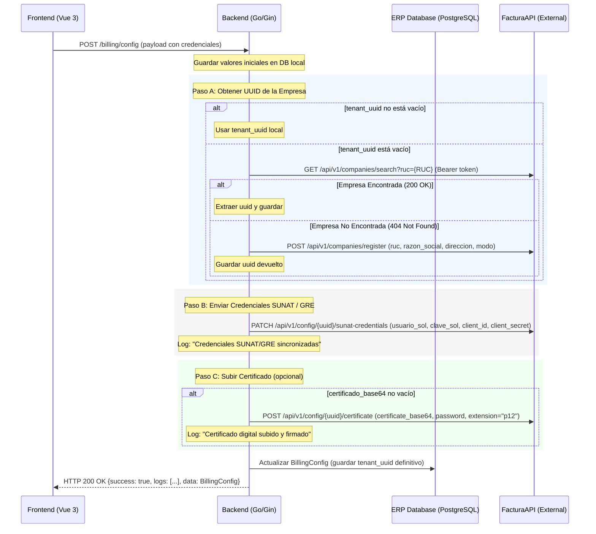

# Especificación de Diseño: Sincronización Automática de Credenciales con FacturaAPI

**Fecha:** 2026-06-14  
**Autor:** Antigravity (AI Coding Assistant)  
**Estado:** Propuesto para revisión del usuario  

---

## 1. Contexto y Objetivos

Actualmente, el ERP local no está enviando ni sincronizando con FacturaAPI (el proveedor externo de facturación electrónica) los siguientes campos de configuración de la empresa:
- **Usuario SOL** (`sol_user` localmente, `usuario_sol` en FacturaAPI)
- **Clave SOL** (`sol_pass` localmente, `clave_sol` en FacturaAPI)
- **Client ID** (`client_id` para API GRE)
- **Client Secret** (`client_secret` para API GRE)
- **Certificado Digital** (`certificado_base64`)

Además, si una empresa ya existe en FacturaAPI, registrarla nuevamente mediante `POST /api/v1/companies/register` causará un error `422 Unprocessable Entity` porque el RUC debe ser único.

El objetivo de este diseño es implementar un flujo de sincronización automática en una sola acción del usuario ("Guardar & Sincronizar") que:
1. Verifique si la empresa ya está registrada en FacturaAPI usando su RUC.
2. Si está registrada, obtenga su UUID (o use el que tenemos guardado localmente).
3. Si no está registrada, la registre en FacturaAPI.
4. Actualice las credenciales SOL y API GRE de la empresa mediante el endpoint `PATCH /api/v1/config/{id}/sunat-credentials` del proveedor.
5. Suba el certificado digital mediante el endpoint `POST /api/v1/config/{id}/certificate` si el usuario ha cargado un nuevo archivo en el frontend.
6. Guarde la configuración de forma local en el ERP para futuras transacciones.
7. Muestre un log en tiempo real al usuario de cada paso completado.

---

## 2. Arquitectura y Flujo de Datos

El flujo de sincronización se describe en el siguiente diagrama:



---

## 3. Cambios en Detalle

### 3.1 Backend (`backend/handlers/billing.go`)

Modificaremos la función `SaveBillingConfig` para enlazar los campos y conectarse a FacturaAPI de forma secuencial.

#### A. Payload de Entrada
Actualizaremos el struct de lectura de datos JSON para mapear todos los campos del frontend:
```go
var input struct {
    ApiURL            string `json:"api_url"`
    ApiKey            string `json:"api_key"`
    TenantUUID        string `json:"tenant_uuid"`
    Modo              string `json:"modo"`
    Estado            string `json:"estado"`
    SolUser           string `json:"sol_user"`
    SolPass           string `json:"sol_pass"`
    CertificadoBase64 string `json:"certificado_base64"`
    ClientID          string `json:"client_id"`
    ClientSecret      string `json:"client_secret"`
}
```

#### B. Flujo de Sincronización en la API del Proveedor
```go
// 1. Obtener datos de la empresa desde la base de datos para recuperar RUC, Razón Social, Dirección, etc.
var company models.Company
if err := config.DB.First(&company, companyID).Error; err != nil {
    // Retornar error
}

// 2. Determinar API URL and API Key (usar los campos del input si existen overrides, o del fallback global)
apiURL := input.ApiURL
apiKey := input.ApiKey
// ... fallback de settings globales si están vacíos ...

// 3. Flujo de Onboarding
logs := []string{}
uuidStr := input.TenantUUID

if uuidStr == "" {
    logs = append(logs, fmt.Sprintf("Buscando empresa con RUC %s en FacturaAPI...", company.RUC))
    // GET /api/v1/companies/search?ruc=company.RUC
    // Si se encuentra: uuidStr = respuesta.uuid, logs = append(logs, "Empresa encontrada en FacturaAPI.")
    // Si no se encuentra:
    //   POST /api/v1/companies/register con payload:
    //   { ruc, razon_social, direccion: company.Direccion, modo: input.Modo }
    //   uuidStr = respuesta.uuid, logs = append(logs, "Empresa registrada exitosamente en FacturaAPI.")
}

// 4. Actualizar Credenciales
logs = append(logs, "Actualizando credenciales SUNAT y API GRE...")
// PATCH /api/v1/config/{uuidStr}/sunat-credentials con payload:
// { usuario_sol: input.SolUser, clave_sol: input.SolPass, client_id: input.ClientID, client_secret: input.ClientSecret }

// 5. Subir Certificado Digital
if input.CertificadoBase64 != "" {
    logs = append(logs, "Subiendo certificado digital .p12...")
    // POST /api/v1/config/{uuidStr}/certificate con payload:
    // { certificate_base64: input.CertificadoBase64, password: input.SolPass, extension: "p12" }
}
```

---

## 4. Mitigación de Riesgos y Seguridad

1. **Credenciales SUNAT / API GRE:** Se transmitirán mediante canales encriptados HTTPS a FacturaAPI. Las claves se guardarán localmente en la base de datos de manera normal.
2. **Contraseña de Certificado:** Dado que el ERP no pide una contraseña independiente para el certificado digital en el formulario actual, utilizaremos por defecto la `Clave SOL` (`sol_pass`). Esto es una práctica común en la emisión electrónica de Perú para simplificar la configuración.
3. **Manejo de Errores de API Externa:** Si algún paso en la API externa falla, interceptaremos el error, detendremos el flujo, y lo retornaremos como `api_error` para que el frontend lo despliegue en la consola de sincronización sin dejar datos inconsistentes localmente.

---

## 5. Criterios de Aceptación y Verificación

1. **Guardado Exitoso:** Al guardar la configuración en el frontend, todos los campos deben persistirse en la tabla `billing_configs` de la base de datos local.
2. **Registro Automático:** Si el RUC no está en FacturaAPI, se registra la empresa y se almacena su `tenant_uuid` localmente.
3. **Manejo de Duplicados:** Si el RUC ya existía en FacturaAPI, se obtiene el `tenant_uuid` correspondiente sin arrojar error 422 de RUC duplicado.
4. **Sincronización Correcta:** Las credenciales y certificados se actualizan correctamente en la API del proveedor mediante las llamadas `PATCH` y `POST`.
5. **Logs de Progreso:** La consola del panel de facturación en el frontend despliega los pasos en orden.
